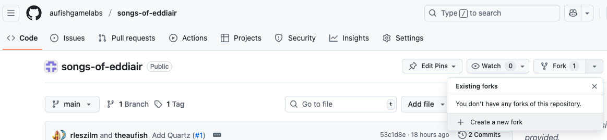
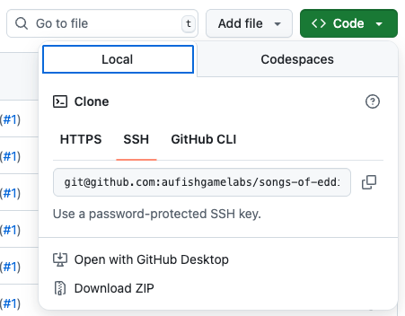

# songs-of-eddiair
## Contributing
1. If you haven't already create a [free github account](https://github.com/) and log in.
2. Navigate to the [aufishgamelabs/songs-of-eddiair repository](https://github.com/aufishgamelabs/songs-of-eddiair).
3. Click the down arrow to the right of `Fork` and create a new fork of the repository within your workspace.
4. Install [git](https://git-scm.com/downloads) for your desired operating system.
5.  
   Click the down arrow on the green `Code` box and choose how you want to checkout the code.
6. In obsidian open the `vault` directory of the checked out code.
7. Edit notes to your hearts contents.
8. Commit your changes and push them to your forked instance of hte repository.
9. In github create a pull request from your repo to the original repo.
10. Repeat steps 7-9 to your hearts content.
